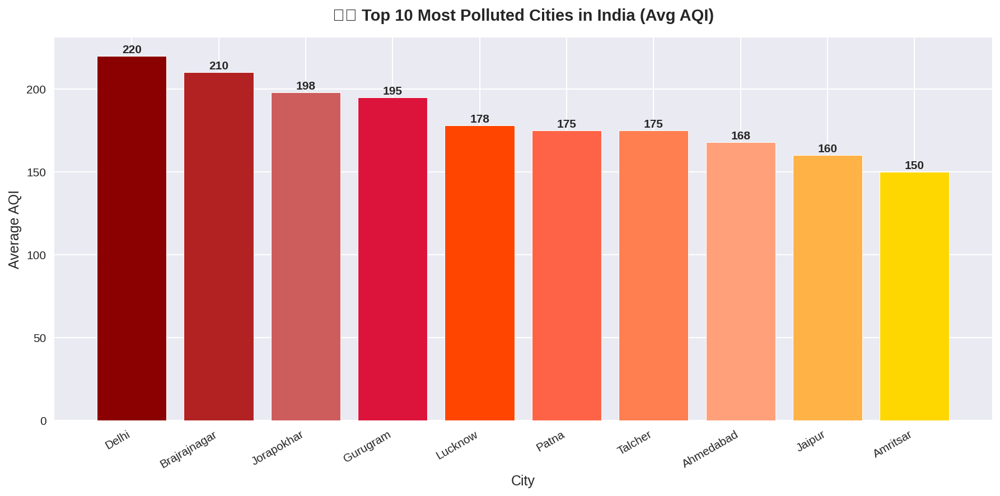
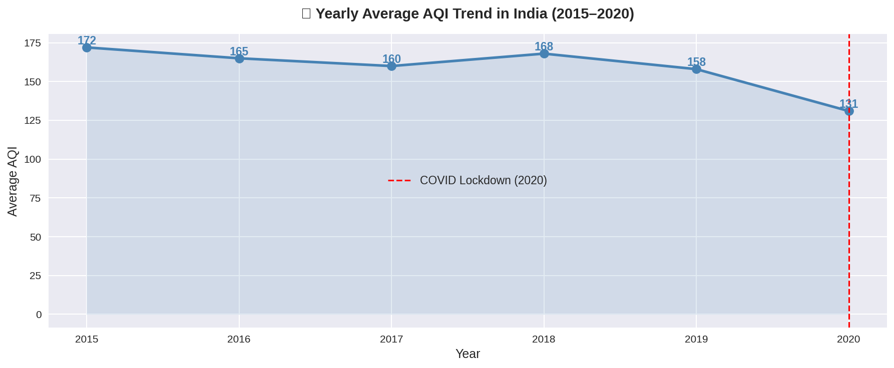
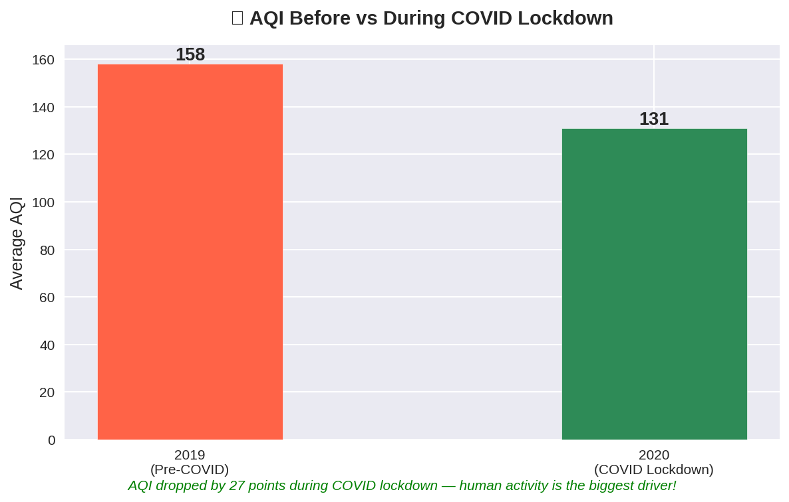
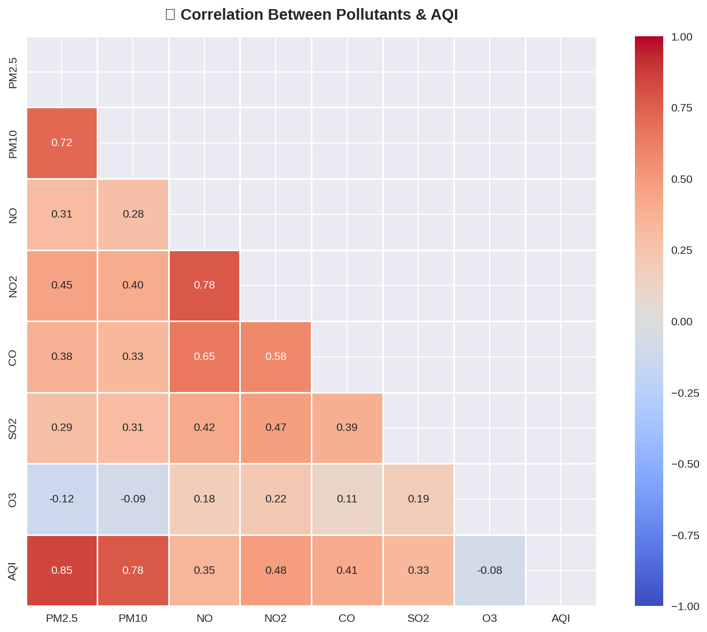
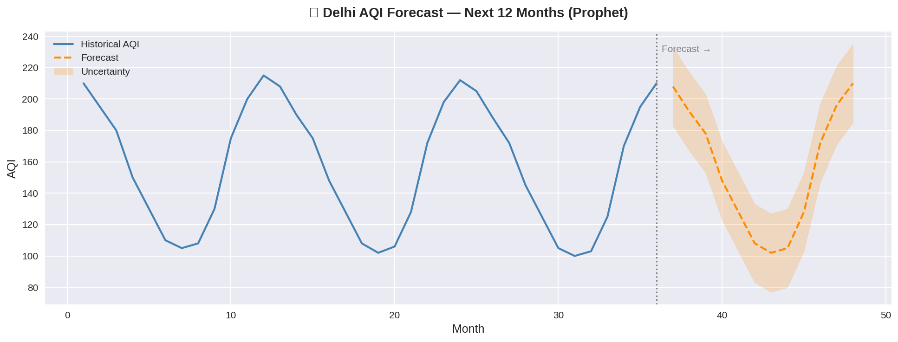

# AQI-India-Analysis
Air Quality Index Analysis of 26 Indian Cities (2015-2020) using Python
# 🌫️ AQI India Analysis (2015–2020)

## 📊 Project Overview
Analysis of Air Quality Index (AQI) data across 26 Indian cities 
from 2015 to 2020 using Python and data analytics techniques.

## 🔍 Key Findings
- Delhi consistently ranked as the most polluted city
- AQI dropped significantly during COVID-19 lockdown (2020)
- PM2.5 & PM10 are the top contributors to high AQI
- Built AQI Forecasting model using Facebook Prophet

## 🛠️ Tech Stack
- Python, Pandas, NumPy
- Matplotlib, Seaborn
- Facebook Prophet (Time Series Forecasting)
- Google Colab

## 📁 Dataset
- Source: [Kaggle - Air Quality Data in India](https://www.kaggle.com/datasets/rohanrao/air-quality-data-in-india)
- Records: 29,531
- Cities: 26
- Period: 2015–2020

## 📈 Analysis Includes
1. Exploratory Data Analysis (EDA)
2. Top 10 Most Polluted Cities
3. AQI Trend Over Time
4. COVID Lockdown Impact on AQI
5. Pollutant Correlation Heatmap
6. Delhi AQI Forecast (Next 1 Year)

## 📊 Visualizations

### Top 10 Most Polluted Cities

### Yearly AQI Trend

### COVID Lockdown Impact

### Pollutant Correlation Heatmap

### Delhi AQI Forecast

## 👨‍💻 Author
**Pratik Ranjan**  
B.Tech ECE | IIIT Nagpur  
[LinkedIn](https://linkedin.com/in/pratik-ranjan) | [GitHub](https://github.com/Pratik2684)
